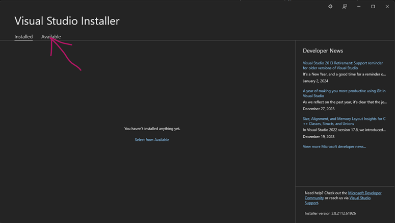
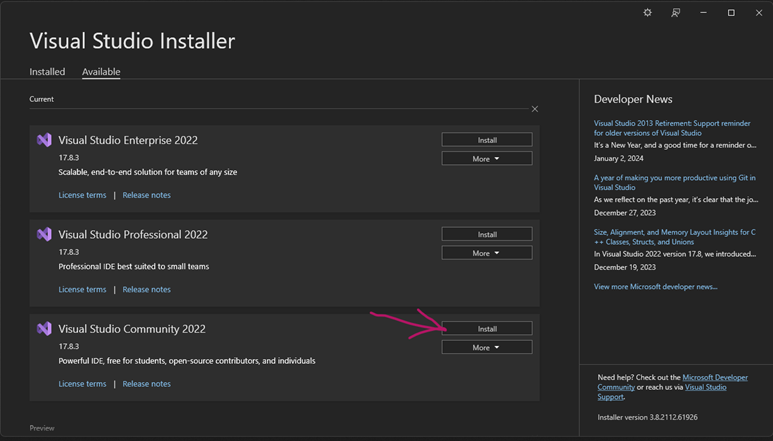
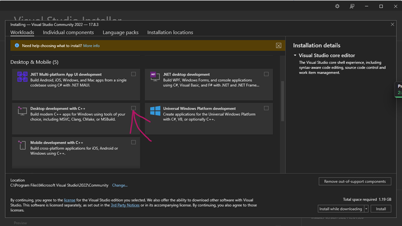
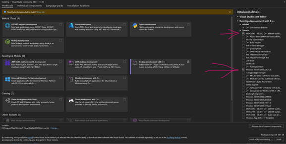
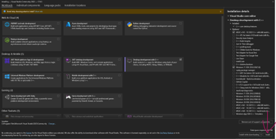

# Python and PyGOM tutorial

## Abstract
Python is one of the most commonly used coding languages, hosting an extensive array of packages in Data Science, Mathematics and Machine Learning. With a syntax that emphasis readability, Python is considered one of the easiest coding languages to learn. It is also free and open source. Therefore, Python code produced in a research project can be more easily shared with others and is more accessible outside of academic institutions. In this class, we will begin by introducing Jupyter Notebook (the medium in which this practical will be given) and the basics of python. We will then introduce the package Numpy and Pandas. Numpy provides support for handling multidimensional arrays and matrices. Pandas provides access to Dataframe and Serries objects. Dataframes being similar to spreadsheets, with Serries being a one-dimensional variant. The final section of this class with introduce PyGOM. PyGOM provides a toolbox for modeling with Ordinary Differential Equations (ODEs). Having been developed by the UK Health Security Agency, PyGOM has an emphasis on epidemiological modelling. Providing functionality not only for solving ODEs, parameter estimation and stochastic simulation, but methods for deriving the basic reproduction number R0. 

## Instructions

The tutorial is given Jupyter Notebook "Python_and_PyGOM.ipnyb". Before using the notebook you will need to follow the installation instructions below.
To use the notebook open Anaconda prompt use the command:
* `conda activate pygom`
* `cd *directory housing ""*` to navigate to the diretory housing "Python_and_PyGOM.ipnyb"
* `jupyter notebook` This should open a web browser window. Double click "Python_and_PyGOM.ipnyb" to open it and begin tutorial.

## Download this repository
To download this specific repository you need to first install git (see section 2.1). Then open git bash and enter the following commands:
1. `cd *download location*` replace \*download location\* with the name of the folder you wish to download this repository to.
2. `git clone https://github.com/m-d-grunnill/Python-and-PyGOM-tutorial.git`

To update this repository in git bash:
1. `cd *repository*` replace \*repository\* with the location of this repository.
2. `git pull`

## Installation Instructions

### 1. Installing Python and Desired packages

1. Go to [Anaconda's installation manual](https://docs.anaconda.com/free/anaconda/install/index.html) and follow instructions for installing anaconda for your particular OS.
2. Once installed navigate to your programs/apps to anaconda->Anaconda prompt. Open anaconda prompt, if in you are running windows you may need to right click and select More->Run as Administrator.
3. Within Anaconda prompt execute the commands:
   1. `conda create --name pygom python==3.11.7` select y when prompted.
   2.	`conda activate pygom`
   3.	`pip install notebook dask matplotlib enum34 pandas python-dateutil numpy scipy sympy seaborn tqdm`

### 2. Installing PyGOM

#### 2.1 Installing git.
PyGOM's setup.py installation file need git to check which version it is. To install git download the installation file 
from git's website below, open the installation file and follow instructions.
* [https://git-scm.com/download](https://git-scm.com/download)

#### 2.2 Installing A C++ compiler

PyGOM relies on Cython which uses C++ to speed up runtime. You will need a C++ compiler. This is different for different OSs. 
For Windows see section 2.2A, Mac see section 2.2B and for Linux 2.2C.

#### 2.2A Installing Microsoft C++ Build Tools (Windows OS ONLY)
PyGOM and a few other python packages require a C++ compiler. Unfortunately, Windows does not come with one. If you do not have a Windows machine skip the next section and go to section 2.2.
1. Go to this link and download Microsoft C++ Build Tools: https://visualstudio.microsoft.com/visual-cpp-build-tools/.
2. Download Microsoft C++ Build Tools:

3. Once downloaded open vs_BuildTools.exe and navigate too “Available”:

4. Select installation of community edition:

5. Select “Desktop development with C++”:

6. Optional: To save on memory you can deselect everything but “MSVC v143 – VS 2022 C++ x64/x86 build tools (Latest)” and “Windows [your version of Windows] SDK”:

7. Then click install:

8. Once installed Visual Studio may start simply close it.
9. Restart your computer.

#### 2.2B Installing Xcode (MAC ONLY)
Follow the instructions outlined one either:
* [https://support.wolfram.com/12799?src=system-modeler](https://support.wolfram.com/12799?src=system-modeler)
* The first 1 min and 48 seconds of [https://www.youtube.com/watch?v=ENy4MdoOxug](https://www.youtube.com/watch?v=ENy4MdoOxug)

#### 2.2C Installing GCC (Linux ONLY)
Follow Steps 1-2 from [https://www.cyberciti.biz/faq/howto-compile-and-run-c-cplusplus-code-in-linux/](https://www.cyberciti.biz/faq/howto-compile-and-run-c-cplusplus-code-in-linux/)

#### 2.3	Installing PyGOM
Unfortunately installing PyGOM via pip is not currently working. However, pygom can be downloaded and then installed locally.

1. Open Anaconda prompt, if in you are running windows you may need to right click and select More->Run as Administrator.
2. Enter commands: 
   1. `conda activate pygom`.
   2. `cd *download location*` replace \*download location\* with the name of the folder you wish to download pygom to.
   3. `git clone https://github.com/ukhsa-collaboration/pygom`
   4. `cd pygom`
   4. `python setup.py install`.
3. Check pygom has been installed by entering the command `conda list` and looking for it in the output list of installed packages.

